# Triends API

👉 [Triends Frontend Github](https://github.com/Sehbeom/triends-frontend)  
👉 [Sehbeom's Triends Dev Log](https://atlantic-node-a40.notion.site/Triends-7a166e4f7cd84bae95706143c969bec0)

## API

---

### 여행지 api (Attraction)
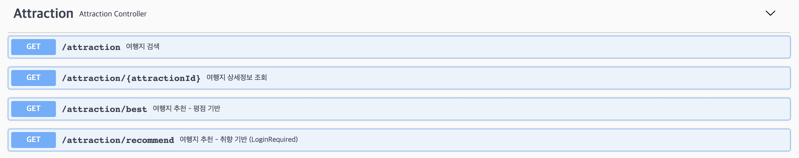

### 댓글 api (Comment)
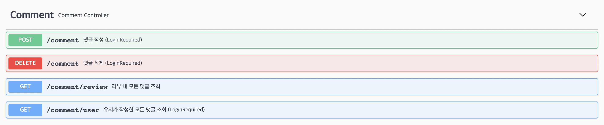

### 친구 api (Friends)
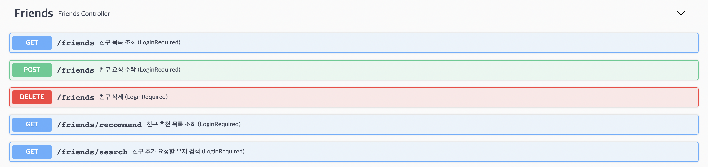

### 공지사항 api (Notice)
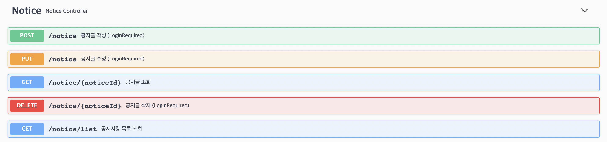

### 알림 api (Notification)
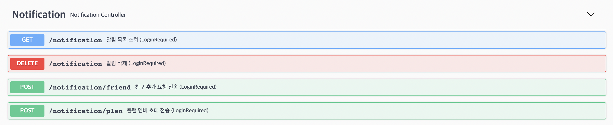

### 플랜 api (Plan)
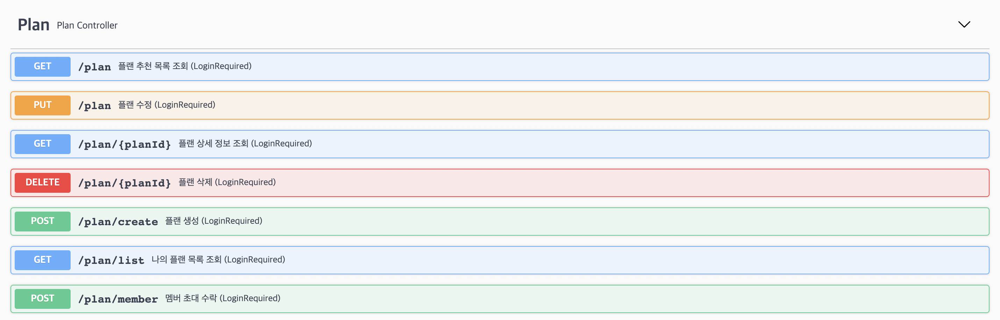

### 리뷰 api (Review)
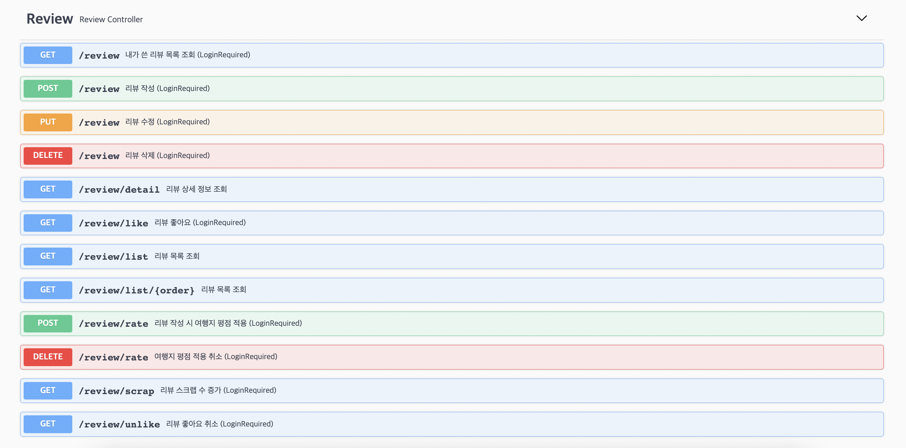

### 유저 api (User)
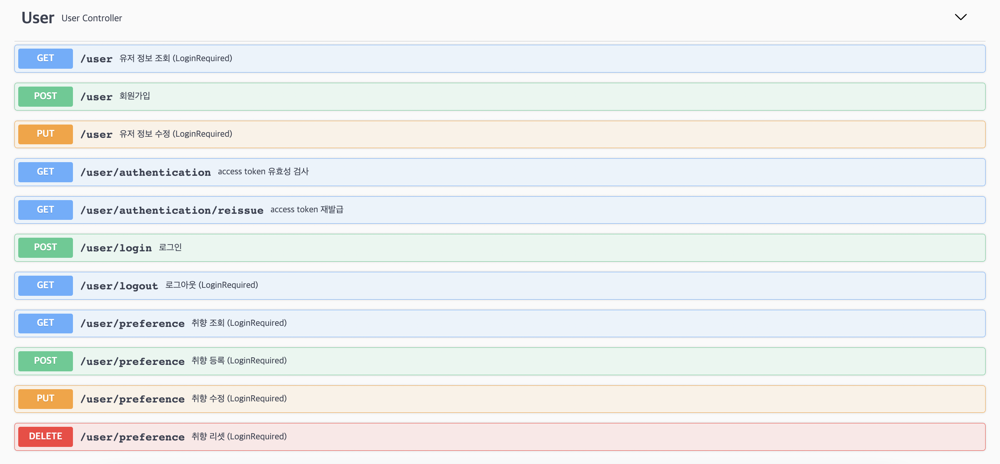

## Model

---

### Response Model
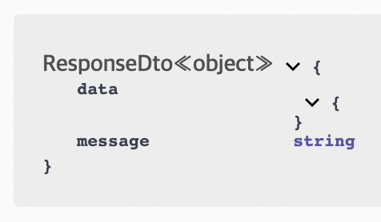

### 여행지 Model
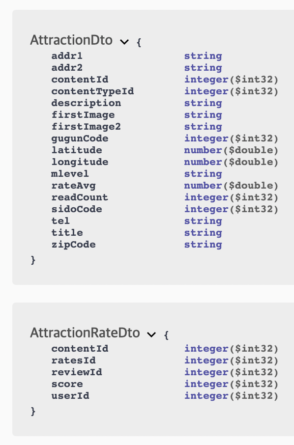

### 댓글 Model
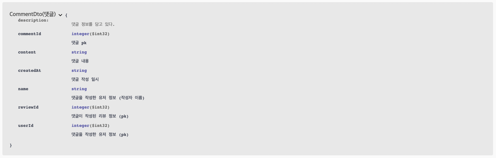

### 플랜 Model
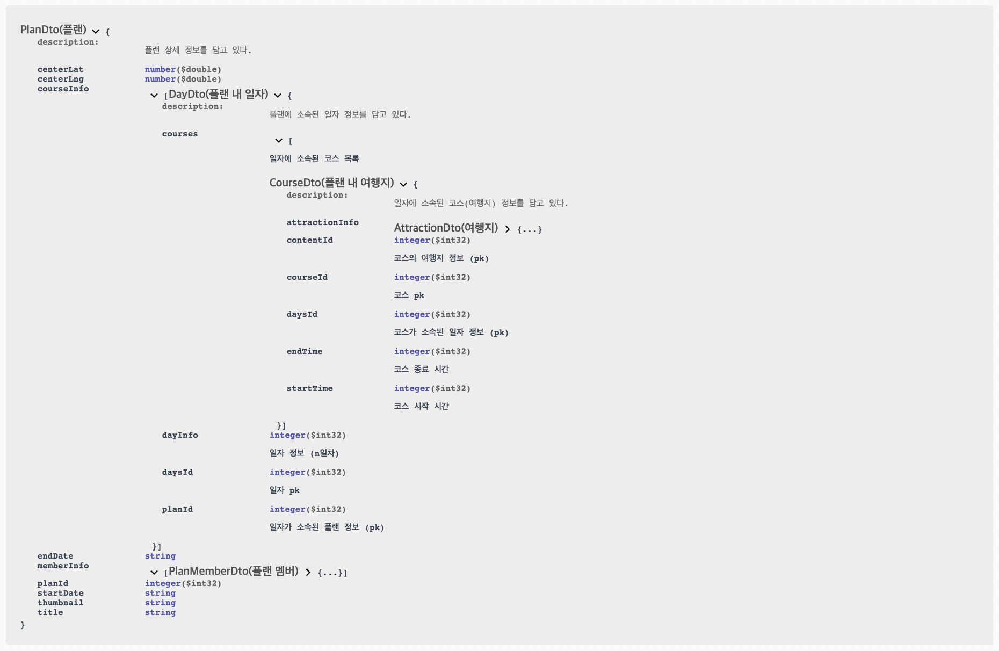

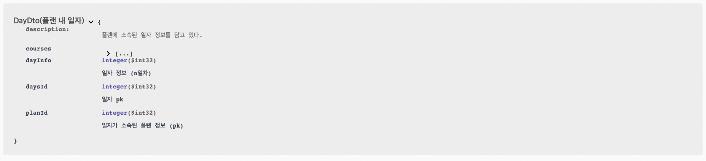

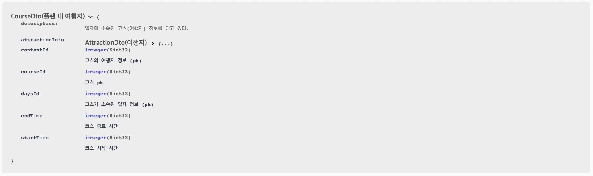

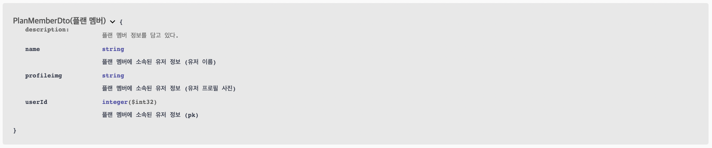

### 공지사항 Model
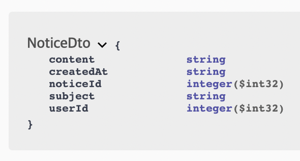

### 리뷰 Model
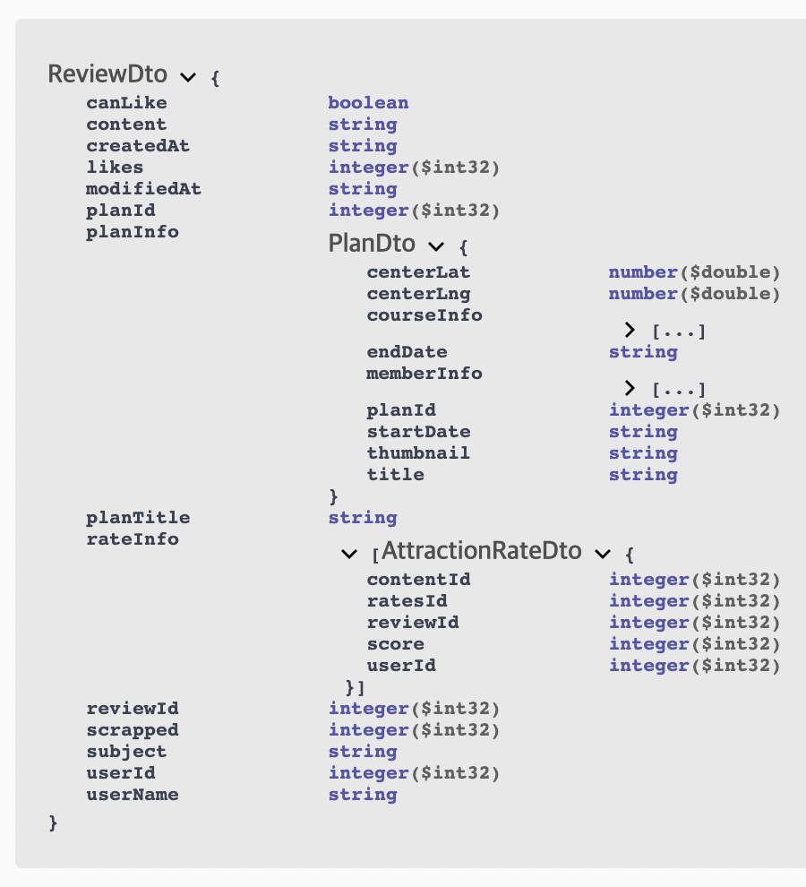

### 유저 Model
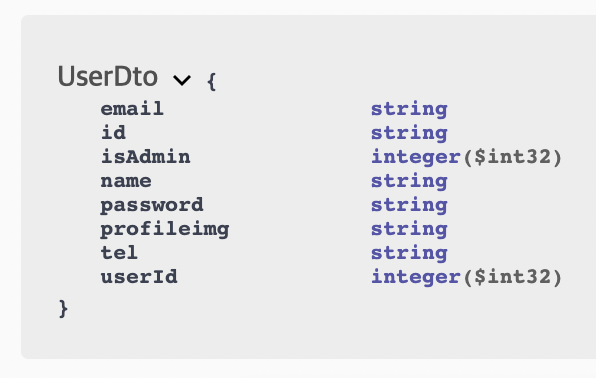

## DB ERD

---

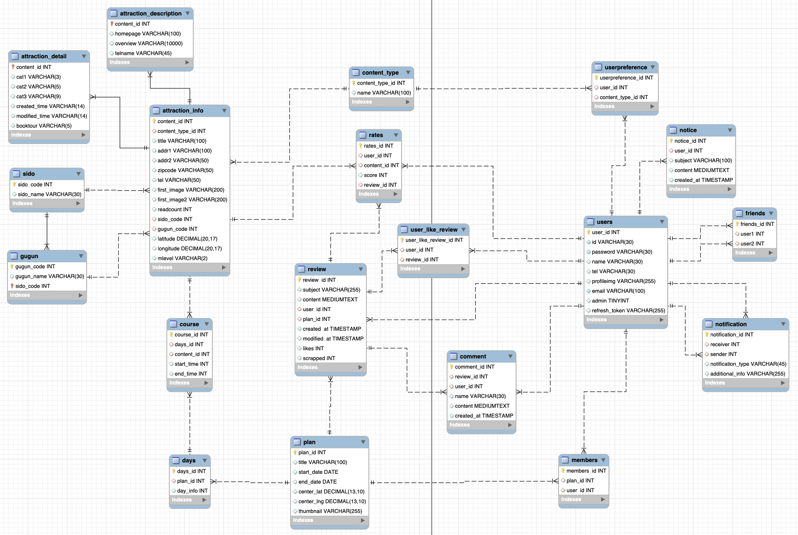
