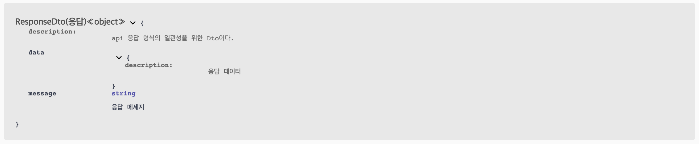
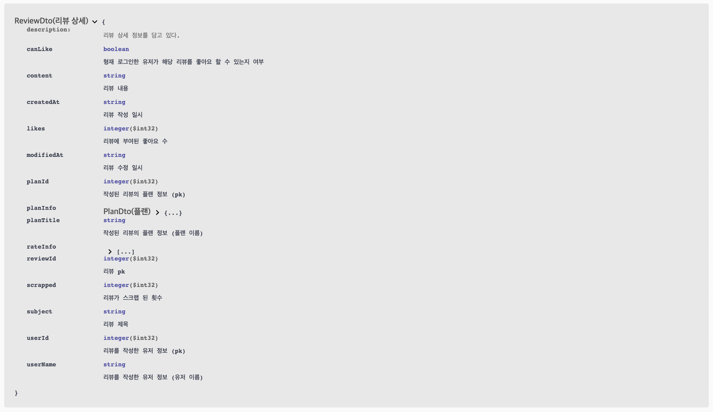

# Triends API

👉 [Triends Frontend Github](https://github.com/Sehbeom/triends-frontend)  
👉 [Sehbeom's Triends Dev Log](https://atlantic-node-a40.notion.site/Triends-7a166e4f7cd84bae95706143c969bec0)

## API

---

### 여행지 api (Attraction)

### 댓글 api (Comment)

### 친구 api (Friends)

### 공지사항 api (Notice)

### 알림 api (Notification)

### 플랜 api (Plan)

### 리뷰 api (Review)

### 유저 api (User)

## Model

---

### Response Model

### 여행지 Model

### 댓글 Model

### 플랜 Model

### 공지사항 Model

### 리뷰 Model

### 유저 Model

## DB ERD

---

